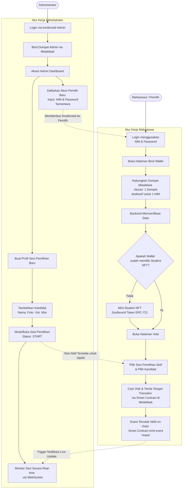
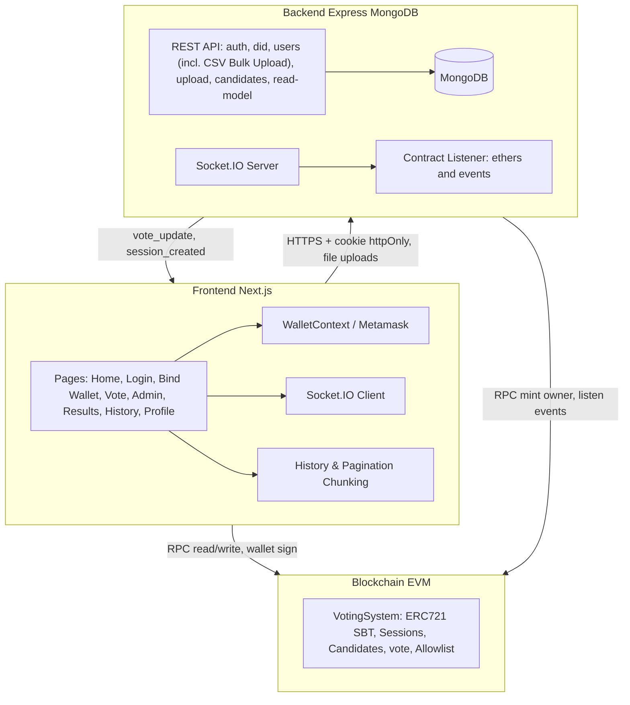
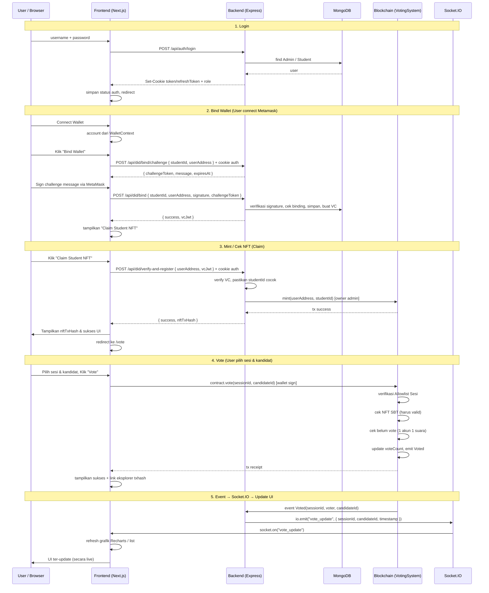

# E-Voting System with Digital Identity (DID)

Sistem E-Voting berbasis blockchain dengan identitas digital terdesentralisasi (DID) yang dirancang untuk organisasi kemahasiswaan. Terdiri dari **Smart Contract terpadu** (Hardhat/Solidity), **backend Node.js/Express** (MongoDB), dan **frontend Next.js**.

---

## Tech Stack

### 🔗 Blockchain & Smart Contract

| Teknologi | Versi | Peran / Alasan |
|-----------|-------|----------------|
| **Solidity** | ^0.8.28 | Bahasa pemrograman smart contract di EVM. Versi 0.8+ memiliki built-in overflow protection dan custom error untuk efisiensi gas. |
| **Hardhat** | ^2.x | Development environment untuk kompilasi, testing, dan deployment smart contract. Dipilih karena fleksibilitas plugin dan dukungan TypeScript. |
| **OpenZeppelin Contracts** | ^5.x | Library standar industri untuk implementasi ERC-721 (NFT) yang telah diaudit keamanannya. Digunakan untuk `Student NFT (Soulbound Token)`. |
| **ethers.js** | v6 | Library JavaScript untuk interaksi dengan blockchain (baca/tulis kontrak, sign transaksi). Digunakan di backend dan frontend. |
| **Sepolia Testnet** | — | Jaringan Ethereum testnet untuk deployment publik sebelum mainnet. Kompatibel penuh dengan EVM. |

### 🖥️ Backend

| Teknologi | Versi | Peran / Alasan |
|-----------|-------|----------------|
| **Node.js** | v18+ | Runtime JavaScript server-side. Dipilih karena dapat berbagi library (ethers.js) dengan frontend dan ekosistem npm yang lengkap. |
| **Express.js** | ^5.x | Framework web minimalis untuk membangun REST API. Digunakan untuk endpoint auth, DID, users, upload, metadata kandidat, dan read model blockchain. |
| **MongoDB** | ^6.x | Database NoSQL untuk menyimpan data user (Student ID, wallet binding, VC). Dipilih karena skema fleksibel untuk data identitas. |
| **Mongoose** | ^9.x | ODM (Object Document Mapper) untuk MongoDB, mempermudah validasi skema dan query. |
| **JSON Web Token (JWT)** | ^9.x | Mekanisme autentikasi berbasis access token + refresh token. Token utama dikirim sebagai cookie httpOnly (`token`, `refreshToken`) dan header Bearer tetap diterima sebagai fallback untuk API tools. |
| **Socket.IO** | ^4.x | Library WebSocket untuk komunikasi real-time. Backend mendengarkan event blockchain lalu meneruskan (`vote_update`, `session_created`) ke frontend tanpa polling. |
| **Swagger UI Express** | ^5.x | Dokumentasi API interaktif di `/api-docs`. |
| **express-validator** | ^7.x | Validasi dan sanitasi input request. |
| **multer** | ^2.x | Upload file (foto kandidat) ke folder `uploads/`. |
| **did-jwt** | ^7.x | Penerbitan dan verifikasi Verifiable Credential (JWT) untuk DID. |
| **bcryptjs** | ^3.x | Hashing password sebelum disimpan ke database. |
| **express-rate-limit** | ^7.x | Middleware pembatas jumlah request per IP untuk mencegah brute-force dan abuse. |

### 🎨 Frontend

| Teknologi | Versi | Peran / Alasan |
|-----------|-------|----------------|
| **Next.js** | 16 (App Router) | Framework React dengan routing berbasis file system, SSR/SSG, dan optimasi built-in. App Router digunakan untuk layout berbasis komponen. |
| **React** | ^18 | Library UI deklaratif. Digunakan dengan hooks (`useState`, `useEffect`, Context API) untuk manajemen state lokal. |
| **TypeScript** | ^5.x | Superset JavaScript dengan static typing. Membantu deteksi bug lebih awal, terutama pada tipe data ABI kontrak dan response API. |
| **ethers.js** | v6 | Digunakan di frontend untuk memanggil kontrak langsung melalui wallet pengguna (MetaMask). |
| **MetaMask** | (Extension) | Wallet browser yang menyediakan signer untuk transaksi on-chain dari frontend. |
| **Socket.IO Client** | ^4.x | Mendengarkan event real-time dari backend (vote terbaru, perubahan status sesi). |
| **react-hot-toast** | ^2.x | Library notifikasi ringan untuk feedback user (sukses/error transaksi). |
| **Tailwind CSS** | ^3.x | Utility-first CSS framework untuk styling cepat dan konsisten. |
| **Recharts** | ^3.x | Library chart untuk visualisasi hasil voting (statistik, grafik). |
| **Framer Motion** | ^11.x | Animasi UI dan transisi. |
| **Lucide React** | ^0.300 | Icon set untuk antarmuka. |

### 🔐 Identitas Digital (DID & VC)

| Konsep | Implementasi | Keterangan |
|--------|-------------|------------|
| **DID (Decentralized Identifier)** | `did:ethr:<walletAddress>` | Identifier unik berbasis alamat wallet Ethereum. Tidak bergantung pada otoritas terpusat. |
| **Verifiable Credential (VC)** | JWT ditandatangani backend | Bukti bahwa Student ID terikat dengan wallet address tertentu. Diverifikasi backend sebelum mint NFT. |
| **Soulbound Token (SBT)** | ERC-721 non-transferable | NFT yang tidak bisa dipindahkan (override `_update` pada transfer antar wallet). Berfungsi sebagai "kartu pemilih" digital yang tidak dapat diperjualbelikan. |

---

## Fitur Utama

-   **Admin Dashboard**:
    -   **Manajemen Sesi**: Membuka dan menutup sesi pemilihan kapan saja. Dilengkapi dengan antarmuka berbasis tab untuk navigasi yang lebih baik.
    -   **Manajemen Kandidat**: Menambah kandidat pada suatu sesi (nama, foto, visi, misi); foto di-upload via API `/api/upload`.
    -   **Batas Pemilih per Sesi (Voter Allowlist)**: Admin dapat membatasi akses voting untuk sesi tertentu hanya kepada pemilih yang terdaftar di allowlist. Chip draft allowlist kini menampilkan nama mahasiswa, bukan sekadar ID atau alamat dompet.
    -   **Manajemen User & Admin**: Mendaftarkan akun pemilih baru secara manual (NIM, nama, password), import pemilih massal via **CSV/XLS/XLSX**, melihat daftar admin, membuat admin baru, dan menautkan wallet admin. Admin wallet otomatis diberi `ADMIN_ROLE` di smart contract jika backend signer memiliki hak yang cukup.
        -   *Format Bulk Upload (CSV/Excel)*: Wajib memiliki kolom NIM dan nama. Alias header yang diterima antara lain `studentId`, `student_id`, `nim`, `username`, `id` untuk NIM dan `name`, `nama`, `fullname`, `full_name`, `nama lengkap` untuk nama. Password massal menggunakan default server `password123` dan tidak dibaca dari file.
    -   **Monitor Real-time**: Memantau daftar sesi secara real-time, dan menggunakan fitur **📊 Detail** untuk melihat statistik per-sesi (Pemilih terdaftar, voter unik, dan persentase partisipasi).
-   **User/Voter Portal**:
    -   Login menggunakan NIM (Student ID) & Password; token disimpan oleh backend sebagai cookie httpOnly, sedangkan frontend hanya menyimpan state UI non-sensitif seperti role/username.
    -   **Profil Pengguna (`/profile`)**: Menampilkan detail informatif seperti NIM, status kepemilikan Student NFT, tombol untuk memutuskan koneksi dompet (Disconnect Wallet), serta tautan cepat ke riwayat pemilihan dan dasbor admin (jika pengguna memiliki peran admin).
    -   **Bind Wallet**: Tautan aman secara spesifik (1-to-1) antara dompet MetaMask dan NIM agar tidak dapat digunakan oleh orang lain. Pengecekan ada di halaman terdedikasi (`/bind-wallet`).
    -   **Verifikasi Identitas**: Menerima Verifiable Credential lalu mengklaim **Student NFT** (Soulbound Token) sebagai akses. Hash transaksi dikembalikan dan ditampilkan di UI ketika proses minting berhasil.
    -   **Voting**: Memberikan suara untuk kandidat langsung ke blokchain menggunakan dompet dan identitas yang diverifikasi.
    -   **Live Results**: Hasil pemilihan muncul dan berubah secara seketika pada layar jika ada block terbaru terverifikasi (via WebSocket).
    -   **Voting History**: Fetch riwayat transaksi yang mulus dengan strategi *chunking* *block range* untuk menghindari limit RPC publik gratis.
-   **Keamanan Ekstra**:
    -   **Unified VotingSystem Contract**: Menggabungkan fitur identitas (ERC721 SBT) dan fungsional voting, sehingga pemeriksaan syarat terpusat pada satu smart contract secara efisien. Termasuk fitur *Voter Allowlist* tingkat *smart contract* per sesi pemilihan.
    -   Pemisahan peran (Admin vs User), tak ada yang dapat mengubah perolehan suara secara sistematis.
    -   Pembaruan vote-counting terjadi secara mutlak satu vote per individu per-sesi pada state on-chain.

---

## Prasyarat Lingkungan

-   **Node.js**: v18+ (Direkomendasikan v20).
-   **MongoDB**: Pastikan MongoDB telah terinstal dan daemon mongod berjalan (default: `mongodb://localhost:27017`).
-   **Metamask**: Ekstensi browser pengguna.

## Struktur Proyek Utama

-   **`contracts/`** — Proyek Hardhat berisi smart contract `VotingSystem.sol` (ERC721 Soulbound + sesi voting, kandidat, vote, allowlist). Skrip deploy: `scripts/deploy_combined.js`.
-   **`backend/`** — Server Express.js (`server.js`). Route: `/api/auth`, `/api/did`, `/api/users`, `/api/upload`, `/api/candidates`, dan `/api/read-model`. Konfigurasi Swagger di `config/swagger.js`, event blockchain di `utils/socketHandler.js`, middleware di `middleware/` (errorHandler, rateLimiter), koneksi DB di `db.js`, file upload disajikan dari `uploads/`.
-   **`frontend/`** — Aplikasi Next.js (App Router). Halaman: `/` (Home, sebelumnya digabung dengan About), `/login`, `/bind-wallet`, `/vote`, `/results`, `/history`, `/profile`, `/admin`. Konteks wallet di `context/WalletContext`, ABI kontrak di `src/contracts/`.
-   **`scripts/`** — Skrip orkestrasi development: `dev.js` (menjalankan node Hardhat → deploy → backend → frontend dari root).

---

## Arsitektur (Frontend – Backend – Blockchain)

Sistem e-voting ini terdiri dari tiga lapisan utama:

| Lapisan | Teknologi | Peran |
|--------|-----------|--------|
| **Frontend** | Next.js (React), ethers.js, Socket.IO client | UI login, profil user, bind wallet, daftar sesi/kandidat, casting vote, pembaruan real-time |
| **Backend** | Node.js, Express, MongoDB, Socket.IO server | Autentikasi (JWT), penerbitan DID/VC, manajemen user, upload foto kandidat, verifikasi VC & pemanggilan mint NFT (sebagai owner), rate limiting, relay event blockchain → klien |
| **Blockchain** | Hardhat, Solidity (`VotingSystem.sol`) | Penyimpanan sesi & kandidat, NFT Student (Soulbound), pencatatan vote on-chain, allowlist, emit event `Voted` / `SessionCreated` / dll. |

Alur data singkat:

1. **Auth & identitas**: User login → backend cek MongoDB (Admin/Student) → set cookie httpOnly access/refresh token → frontend menyimpan role/username untuk UI. Masuk ke profil (`/profile`) atau laman Bind Wallet → backend membuat challenge → user sign message dengan wallet → backend simpan binding + buat VC → klaim NFT (tampilkan Tx Hash) → backend verifikasi VC lalu memanggil `VotingSystem.mint()`.
2. **Voting**: User pilih kandidat di frontend → wallet sign tx → `VotingSystem.vote(sessionId, candidateId)` → kontrak mem-filter prasyarat NFT, allowlist, dan emit `Voted` → backend mendengar event → Socket.IO event dikirim → frontend merefresh UI secara live.

---

## Flowchart Proyek

Diagram di bawah mencontohkan proses linear dari proyek E-Voting berdasarkan aktor dominan (Admin & Mahasiswa):



---

## Diagram Komponen



---

## Diagram Sequence: Alur Lengkap



---

## Alur: Login sampai Vote

1. **Login**  
   User memasukkan username (NIM atau username admin) dan password. Frontend memanggil `POST /api/auth/login`. Backend memeriksa MongoDB (Admin atau Student), mengirim access token dan refresh token sebagai cookie httpOnly, lalu mengembalikan role/username untuk state UI.

2. **Bind wallet**  
   User membuka halaman khusus Bind Wallet (`/bind-wallet`) dan menghubungkan MetaMask. Frontend lebih dulu memanggil `POST /api/did/bind/challenge`, lalu user menandatangani message challenge dari backend. Setelah itu frontend mengirim `POST /api/did/bind` beserta `signature` dan `challengeToken`. Backend memastikan wallet benar-benar dimiliki user dan binding NIM ↔ wallet tetap eksklusif 1:1.

3. **Klaim Student NFT**  
   Pada halaman yang sama (`/bind-wallet`), pengguna meng-klik "Claim Student NFT". Frontend akan meneruskan payload VC ke backend melalui endpoint `/api/did/verify-and-register`. Backend memverifikasi tanda tangannya, bertindak sebagai *admin proxy* pada blockchain, lalu menerbitkan (mint) Token ERC-721 Soulbound milik pengguna. 

4. **Pemilihan Sesi & Casting Vote**  
   Di halaman Vote (`/vote`), frontend memuat daftar sesi dari node/kontrak. Ketika user memberikan suaranya, frontend memanggil `contract.vote(sessionId, candidateId)` yang memaksa konfirmasi langsung pada Metamask wallet pengguna. Kontrak melakukan on-chain re-verification pada kepemilikan NFT & syarat-syarat khusus (satu akun dapat 1 kesempatan), kemudian menambah suara kandidat.

5. **Pembaruan real-time**  
   Segala emit event on-chain (`Voted`, `SessionCreated`, `SessionStatusChanged`, `CandidateAdded`) diamati oleh listener backend. Backend kemudian meneruskan event ke client lewat Socket.IO. Untuk event `vote_update`, payload yang dikirim sengaja tidak memuat alamat voter demi menjaga privasi.

---

## Memulai Cepat (Skrip Root)

Dari **root folder** repositori ini, Anda bisa langsung menjalankan seluruh sistem untuk mode development.

**Harap Diperhatikan:** Pastikan MongoDB dapat dijangkau dan file environment sudah dibuat dari template `.env.example` di `backend/` dan `frontend/`.

```bash
# Instal seluruh package node-modules ke semua folder anak 
npm run install:all

# Booting bersamaan otomatis Hardhat RPC -> deploy kontrak -> backend -> frontend
npm run dev
```

Anda bisa menavigasi ke lokal host berikut ini segera setelah skrip berjalan paralel:

- **Akses UI Frontend:** http://localhost:3000  
- **API Backend:** http://localhost:3001  
- **API Docs (Swagger):** http://localhost:3001/api-docs  
- **RPC Hardhat Node Lokal:** http://127.0.0.1:8545  

## Pengaturan Deployment Manual

Bila tidak menggunakan skrip root, Anda dapat menjalankannya manual berdasarkan hierarki dependensi berikut:

### 1. Smart Contracts (Hardhat)

1.  Buka terminal pada sesi `contracts`:
    ```bash
    cd contracts
    npm install
    ```
2.  Mulai instance Virtual Node Ethereum (biarkan terminal ini menyala):
    ```bash
    npx hardhat node
    ```
3.  **Di tab terminal terpisah**, deploy Smart Contract-nya:
    ```bash
    npx hardhat run scripts/deploy_combined.js --network localhost
    ```
    > **Info**: Skrip `deploy_combined.js` sudah ditingkatkan sedemikian rupa sehingga:
    > - Mendeploy `VotingSystem.sol`.
    > - Otomatis merekayasa baris `NEXT_PUBLIC_VOTING_SYSTEM_ADDRESS` pada `frontend/.env`.
    > - Otomatis mengisi `VOTING_SYSTEM_ADDRESS` di file `backend/.env`.
    > - Menyalin ulang ABI (`VotingSystem.json`) ke modul antarmuka `frontend/src/contracts/`.

### 2. Backend (Express + MongoDB)

1.  Di sesi terminal lain masuk ke direktori backend:
    ```bash
    cd backend
    npm install
    cp .env.example .env
    ```
2. Pastikan file `.env` minimal berisi `JWT_SECRET`, `JWT_REFRESH_SECRET`, `ADMIN_PRIVATE_KEY`, `VC_ISSUER_PRIVATE_KEY`, `BLOCKCHAIN_RPC_URL`, dan `VOTING_SYSTEM_ADDRESS`.
3. Nyalakan layanan:
    ```bash
    npm run dev
    ```
   Catatan: `npm run dev` di backend saat ini memakai `node --watch server.js`, sehingga server restart otomatis saat file backend berubah.

### 3. Frontend (Next.js)

1. Pastikan Anda punya terminal sisa lainnya lagi:
    ```bash
    cd frontend
    npm install
    cp .env.example .env 
    ```
2. Nyalakan interface user development:
    ```bash
    npm run dev
    ```

---

## Panduan Penggunaan Minimum

### Alur Kerja Administrator
1. Login sebagai Admin (berdasarkan konfigurasi `ADMIN_USERNAME` & `ADMIN_PASSWORD` pada `.env` back-end).
2. Tautkan **Dompet Admin** dApp (yang biasanya digunakan memakai Akun #0 / #1 pada instance Hardhat).
3. Navigasikan ke **Admin Dashboard**.
4. Disini admin dapat memanfaatkan fitur **"Tambah Akun Pemilih Baru"** dengan men-setup NIM/User ID beserta Password sementaranya.
5. Buat profil Sesi Pemilihan lalu inisialisasi input nama daftar kandidat. Klik **START** untuk langsung membuka jadwal polling session.

### Alur Kerja Mahasiswa
1. Mahasiswa login terlebih dulu memanfaatkan kredensial yang sebelumnya dikelola koordinator.
2. Pergi langsung ke **Bind Wallet** sebagai portal setup identifikasi pengguna independen.
3. Konek dompet web3 wallet MetaMask. *Ingat: 1 dompet eksklusif untuk 1 Nomor Induk Mahasiswa*.
4. **Claim Identitas NFT**: Tekan klaim untuk mendapat aset kripto kredensial untuk dapat mem-ping smart contract.
5. Klik Menu **Vote**, cast suaramu untuk kandidat yang sedang open status. Transaksi akan terposting ke riwayat voting public ledger.

---

## Troubleshooting

-   **Kendala Interaksi Ekstensi**: Apabila Anda sempat me-restart instance local Hardhat-node RPC `npx hardhat node`, maka sangat diharuskan untuk **mereset setelan riwayat aktivitas akun testing Metamask** (Seringakali memicu Nonce Too High / Low error). Buka tab Metamask Settings -> Advanced -> Clear Activity Tab Data.
-   **Alamat Kontrak Kedaluwarsa**: Saat menjalankan deployment terpisah, harap pastikan parameter environment .env baik di bagian `frontend/.env` dan `backend/.env` mencatut String yang serupa dan padu (`VOTING_SYSTEM_ADDRESS`).
-   **Event real-time tidak terdeteksi**: Backend menggunakan polling fallback saat WebSocket tidak tersedia. Variabel opsional di `backend/.env`:
    -   `BLOCKCHAIN_WS_URL` – URL WebSocket (ws:// atau wss://) untuk event real-time; bila tidak diset, gunakan HTTP + polling
    -   `EVENT_POLL_INTERVAL_MS` – Interval polling dalam ms (default: 5000)
    -   `EVENT_POLL_BACKUP=true` – Paksa polling tetap aktif walaupun provider WebSocket tersedia
# EvotingBlockchain
